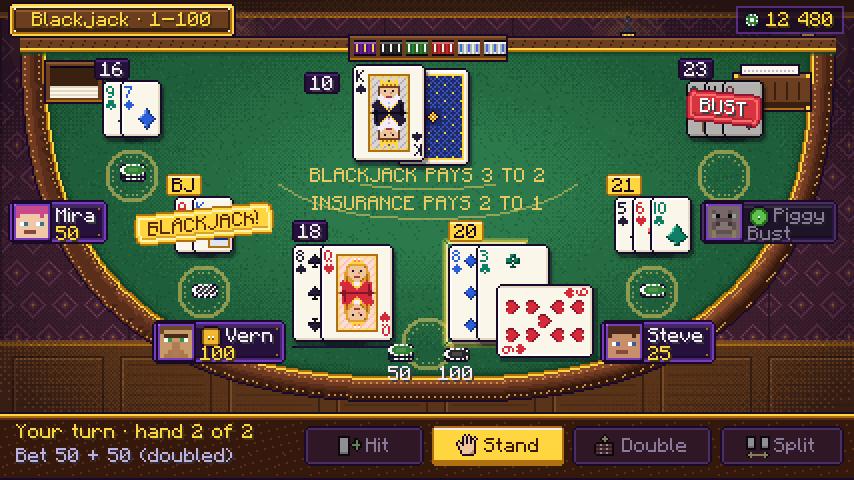
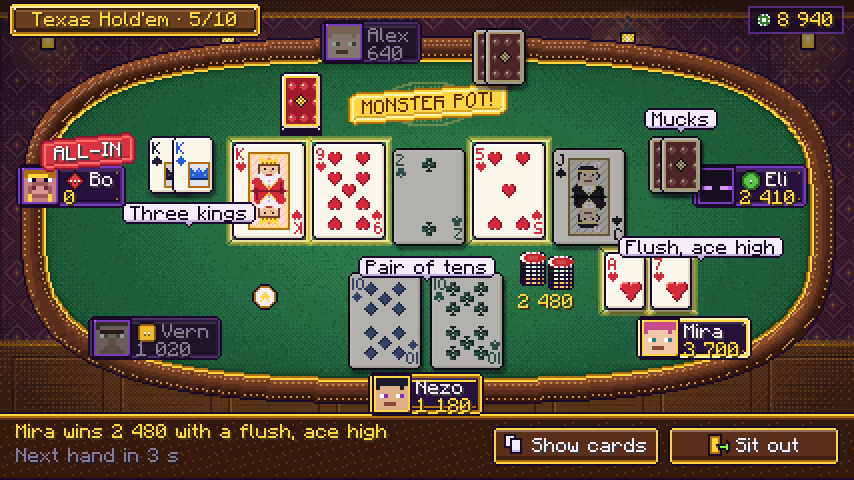
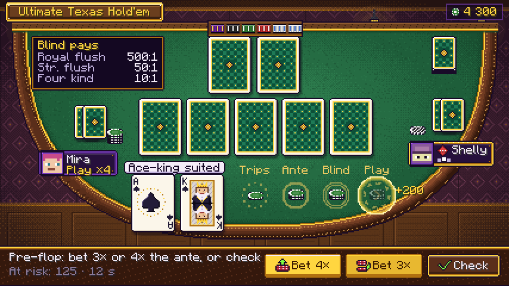
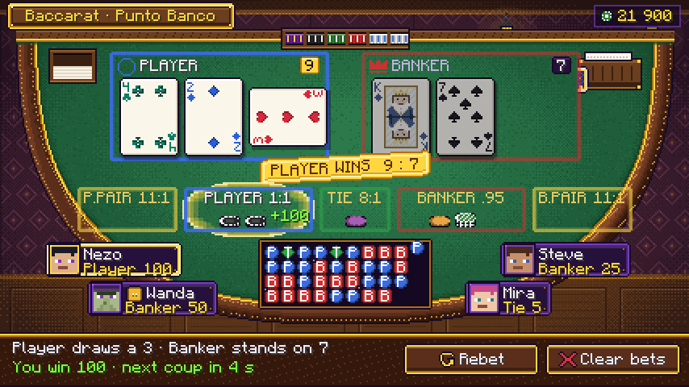
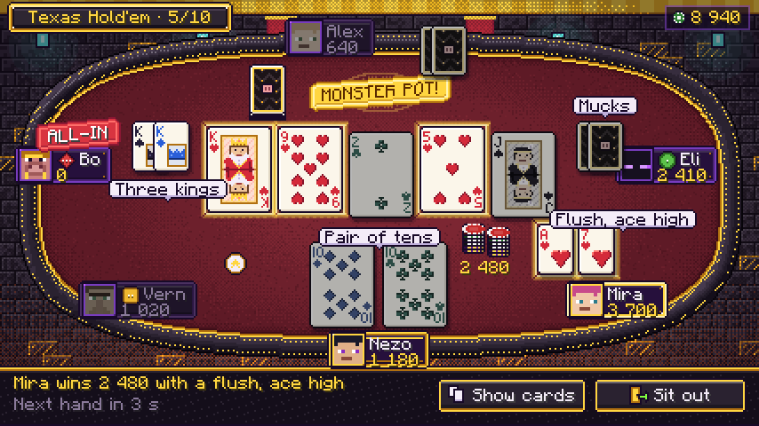
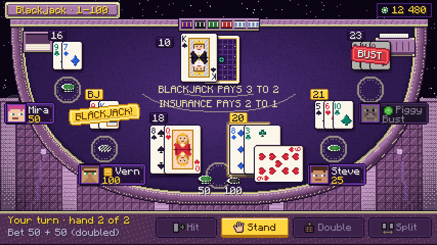
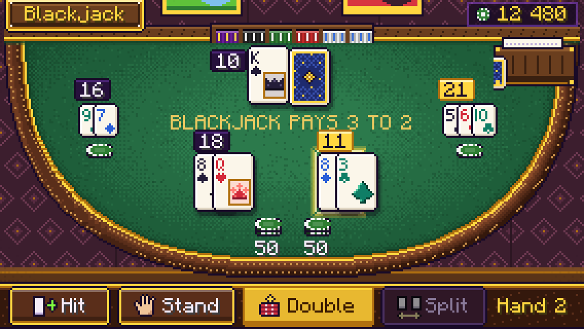

# Card tables — visual redesign (Blackjack, Texas Hold'em, Ultimate Texas Hold'em, Baccarat / Chemin de fer)

Status: design-ready, 2026-09-24. **Java only** (the project dropped Bedrock on 2026-09-24; see §11).
Owner of the art: `tools/assets/modules/cards.mjs` + `modules/cards/*` (the asset generator in `tools/`).

This spec gives the four card games the look the new slots set as the quality bar: a themed room behind a
framed play area, crisp pixel art at a fixed pixel grid, casino buttons with icons, and celebrations per tier.
It **builds on** `docs/design/animation/cards.md` (motion, timing, faithfulness, sounds). Everything that doc
says about *when* something moves still holds; this doc says *what it looks like and where it sits*. Where the
new layout changed an animation detail, `animation/cards.md` was edited in the same change (§12 lists every edit).



**Contents**
1. Direction and rules
2. The table: felt, rail, prints
3. Cards: faces, backs, the index font, colour-blind safety
4. Dealer props: shoe, discard tray, deck, rack, dealer button
5. Chips on bet spots
6. Screen layout (GUI scale 2 at 854 × 480, bigger and smaller GUIs), per game
7. Themes per casino location
8. Buttons, seat plates, bots, tags, stamps, tiers and celebrations
9. Asset list (generated)
10. Mockups
11. Editions: Java only; no glyph plane
12. Changes made to `animation/cards.md`
13. Lang keys this design needs
14. Implementation notes for the Java lanes

---

## 1. Direction and rules

- **Look.** A lamp-lit casino table seen from the player's chair: a padded rail framing a spot-lit felt,
  chunky pixel-art cards with an ink outline, gold trim. The room behind the table tells you where you are
  (village parlour, Piglin bastion, End City lounge).
- **One pixel grid.** Every texture is drawn at 1 texel = 1 GUI pixel and blitted at integer positions and
  integer scales (never 0.5 ×, never bilinear). Tweens (animation/cards.md K1–K13) move whole sprites; rotation
  is allowed only mid-flight (K1, K5, K6) and for the classic sideways card (§3.6).
- **Palette.** Brand palette (`docs/branding/branding.md`, `lib/palette.mjs`) for UI (ink `#180A28`, deep purple
  `#26103C`, frame `#783CBE`, glint `#BE5AFF`, gold `#FFD640` / `#B07010`, bone `#F4ECF8`, bonus green
  `#80FF40`, chip reds). Material colours per theme live in `modules/cards/theme.mjs` (§7).
- **Light from the top-left.** Bevels, the rail's shading, chips and pips all use it.
- **No words in any texture.** Titles, labels, totals, rank indices and stamp words are runtime text. Digits
  and suit symbols are allowed in the in-world atlas only (language-neutral, §3.8).
- **Colour never carries meaning alone** (§3.5, §5.4, §8.3): suits, bet boxes, UTH circles, beads and bot levels
  all have distinct shapes.

## 2. The table: felt, rail, prints

### 2.1 Shapes and sizes

| Shape | Games | Full size | Compact size | Geometry |
|---|---|---|---|---|
| `crescent` | Blackjack, UTH, Baccarat, Chemin de fer | 408 × 184 | 280 × 124 | lower half of a superellipse (exponent 2.6), centre on the top edge; straight dealer edge at the top |
| `oval` | Texas Hold'em | 408 × 184 | 280 × 124 | full superellipse (exponent 3.2), a rounded stadium |

Files: `textures/gui/core/cards/table_<shape>_<theme>[_compact].png` (12 PNGs), transparent outside the table.
They are pictures, blitted 1 : 1 (`guiGraphics.blit(RenderType::guiTextured, id, x, y, 0, 0, w, h, w, h)`).

### 2.2 How the table is drawn (generator, `cards/table.mjs`)

From the outside in, by distance `d` from the table edge (a chamfer distance field of the shape mask):

| d (px) | Layer | Detail |
|---|---|---|
| 0–1 | ink edge | `#180A28` (bastion: `#07040A`) |
| 1–12 (9 compact) | padded rail | a bump profile lit by the distance-field normal: `padLight`/`pad`/`padDark` in 5 bands, a dithered specular fleck along the crest, two dotted **stitch seams** (every 3rd pixel) |
| 12–14 | trim | `trim` / `trimShade`, lit side facing the light |
| 14–19 | inner shadow | Bayer-dithered darkening toward `feltDark` |
| > 14 | felt | base `felt`, a dithered **spotlight** (2 bands toward `feltLight`) centred at 42 % height (crescent) / 50 % (oval), 6 % weave noise |

The crescent's top edge is the **dealer edge**: a 6 px wood strip (`wood`, `woodLight` highlight) with a trim
line and a 2 px felt shadow under it. The dealer's rack sits on it (§4).

### 2.3 Felt prints

Prints are **white sprites** tinted by code with the theme's `print` colour at **55 % alpha** (baccarat boxes use
their box colour, §5.4). One felt serves every game, and layouts can move without new art.

| Sprite (`core/cards/print/…`) | Size | Use |
|---|---|---|
| `spot` | 28 × 28 | blackjack bet spot, poker bet line spot (2 px ring + dotted inner ring) |
| `uth_trips`, `uth_ante`, `uth_blind`, `uth_play` | 24 × 24 | UTH circles; the **ring style** carries the meaning: dotted Trips (+ three dots), solid Ante (+ inner ring), double Blind (+ closed eye), dashed Play (+ chevron) |
| `box` | 32 × 24, nine-slice border 5 | baccarat bet boxes and hand panels (2 px rounded line + a 35 % inner line) |
| `emblem_player` / `_banker` / `_tie` / `_pair` | 11 × 11 | box emblems: ring / crown / equals / two cards |
| `slot_l`, `slot_m` | 37 × 49, 21 × 29 | dashed card outline (board slots, empty hand slots) at 30 % alpha |
| `pot` | 48 × 24 | pot well (oval ring + dotted inner ring) at 35 % alpha |
| `insurance` | 232 × 30 | blackjack insurance band: two arcs concentric with the crescent (0.44 / 0.52 of the table) |

Printed words (`BLACKJACK PAYS 3 TO 2`, `INSURANCE PAYS 2 TO 1`, circle labels, box labels) are runtime text in
the `print` colour, no shadow, centred on their anchors (§6).

## 3. Cards

### 3.1 Sizes (replaces animation/cards.md §0.3 sizes)

| Size | Px | Use | Content |
|---|---|---|---|
| **L** | 37 × 49 | the viewer's hands, the dealer, the board, both baccarat hands | runtime index top-left and (rotated 180°) bottom-right; small suit under each index; standard pip layouts 2–10; ace = big pip in a gold flourish ring; courts = double-headed portraits |
| **M** | 21 × 29 | other seats; the viewer's inactive split hands when there are 3–4 hands; compact layout main size | runtime index top-left, small suit under it, one 11 px pip (courts: an 11 × 13 framed crown / flower-tiara / feather emblem) bottom-right |
| **S** | 13 × 17 | compact layout other seats, side-pot and muck icons, tray top card | runtime index top-left, small suit bottom-right |
| **W** | 16 × 22 | the in-world BER atlas | baked language-neutral index (§3.8) |

At GUI scale 2 an L card is 74 × 98 screen pixels, readable from across the room.

### 3.2 Anatomy (L)

```
x: 0 1 2 . . . 7 8 . . . . . . . . . . . . . . . . . . . . 28 29 . . 34 35 36
   ink, 2 px rounded corners; paper #FBF6EA; 1 px white highlight top/left; 1 px #E2D8C4 shade bottom/right
   index gutter x 2..7   (rank: runtime, rows 3..8)         pip field x 8..28        mirrored gutter x 29..34
   small suit 5 × 5 at (2, 10)                                                         and (30, 34), upside down
   pip columns at x 8 / 15 / 22 (7 × 7 pips); rows at y 5 · 10/13/15 · 21 · 27/29/32 · 37 (lower half upside down)
```

- **Rank index** = runtime text: `Component.translatable("gui.burmaldaholic.card.rank.<r>")` (2–9 are literal
  digits) drawn with the font **`burmaldaholic:core/card_index`** (§3.4) in the suit colour at (2, 3); the
  bottom-right copy is the same text rotated 180° about the card centre (`pose().rotateAround`) at
  (w − 2 − width, h − 9). RU shows Т / К / Д / В.
- **Pips**: hand-drawn 7 × 7 shapes (below) with a 1 px dark edge on the bottom-right; the lower half of every
  layout is upside down, like a real deck.
- **Ace**: a 17 px bevelled pip in a 25 px ring of alternating gold / gold-shade dots.
- **Courts** (J, Q, K): a 21 × 39 panel with a gold frame, a hatched ground in the suit's light tint, a 15 × 17
  bust drawn upright and mirrored (double-headed), split by a line in the suit's dark colour, and two small
  suit pips in the free corners. K: crowned, white-bearded, ermine collar. Q: tiara, long golden hair.
  J: feathered cap, black hair. Robes are the suit colour, so the court reads the suit at a glance.

### 3.3 Suit shapes

| Suit | 7 × 7 pip | 5 × 5 index pip |
|---|---|---|
| ♠ | `...#...` `..###..` `.#####.` `#######` `#######` `...#...` `..###..` | `..#..` `.###.` `#####` `#####` `..#..` |
| ♥ | `.##.##.` `#######` `#######` `#######` `.#####.` `..###..` `...#...` | `.#.#.` `#####` `#####` `.###.` `..#..` |
| ♦ | `...#...` `..###..` `.#####.` `#######` `.#####.` `..###..` `...#...` | `..#..` `.###.` `#####` `.###.` `..#..` |
| ♣ | `..###..` `..###..` `###.###` `#######` `###.###` `...#...` `..###..` | `.###.` `.###.` `#####` `##.##` `..#..` |

Larger pips (11, 17 px: M cards, the ace, particles) are supersampled geometry (circles + triangles) in
`cards/suits.mjs`, then bevelled.

### 3.4 The index font (runtime text, not baked)

`textures/font/core/card_index.png` (128 × 16, 8 × 8 cells) + `font/core/card_index.json` (a `bitmap` provider,
height 8, ascent 7; generated). Glyphs are 6 px tall and ≤ 5 px wide: `0–9 A J Q K X` and `Т В Д К`. The `1` is a
single bar, so **`10` is 6 px wide** and fits the gutter. White glyphs, tinted by the draw colour.

### 3.5 Colour-blind safe deck (default)

Default is a **four-colour deck** where hue *and* luminance differ, on top of four distinct shapes:

| Suit | Base | Light | Dark | Greyscale luminance |
|---|---|---|---|---|
| ♠ spades | `#231C38` | `#5A4E7A` | `#0E0A18` | darkest |
| ♥ hearts | `#D42A3A` | `#FF7A72` | `#86142A` | mid |
| ♦ diamonds | `#2A5ED8` | `#7AA6FF` | `#14307A` | mid, blue axis (safe for protan/deutan) |
| ♣ clubs | `#0F7E66` | `#52C8A2` | `#064234` | dark-mid, teal (not grass green, so it never meets red on the red–green axis) |

The **classic two-colour deck** (♠♣ `#231C38`, ♥♦ `#D42A3A`) is an opt-in setting
(`gui.burmaldaholic.menu.settings.four_colour_deck`, default on); both atlases are generated
(`faces_<size>.png`, `faces_<size>_classic.png`). The index is always drawn in the suit colour of the chosen
deck. Narration (animation/cards.md §0.6) names the suit, so nothing depends on sight.

### 3.6 Special card poses

- **Sideways card**: the blackjack double card and the baccarat third card are dealt rotated 90° (a 49 × 37
  footprint), overlapping the hand at (+24, +20) (blackjack) or placed after the two cards (baccarat, §6.5).
  The runtime index rotates with the card.
- **Hole card**: tucked 22 px right of and 2 px below the dealer's up card, *under* it.
- **Dimmed** (a losing hand, cards not in the best five, a folded seat): desaturate 60 % and × 0.72 brightness
  (animation/cards.md K11 tint `0xFF8A8A8A` stays as the implementation of it).
- **Lifted** (best five, the active card): −3 px y, with the K9 glow behind.

### 3.7 Backs (`textures/gui/core/cards/backs.png`)

Six designs × four sizes (columns L | M | S | W at x 0 / 37 / 58 / 71; rows of 49 px). Every back has the
paper border, a gold inner line and (L, M, W) a centre emblem.

| Row | Design | Pattern · emblem | Used by |
|---|---|---|---|
| 0 | `navy` | lattice, gold dots · gold diamond | blackjack (village) |
| 1 | `burgundy` | damask · gold diamond | baccarat, chemin de fer (village) |
| 2 | `crimson` | diamonds · gold diamond | Texas Hold'em (village) |
| 3 | `emerald` | check · gold diamond | UTH (village) |
| 4 | `bastion` | gold zigzag on blackstone · piglin snout | every game in a bastion parlour |
| 5 | `end` | purpur tiles · ender eye | every game in the End lounge |

### 3.8 In-world atlas (BER)

`textures/entity/core/cards/faces.png` (256 × 256): 13 × 4 W faces (16 × 22) at the top-left (rows ♠♥♦♣), the six
W backs at y 88 (x = 16 · row), a blank face at (96, 88) and a card-edge strip at (112, 88). World faces are too
small for runtime text, so their indices are **language-neutral**: digits 2–10 in the index font's shapes,
court emblems (crown K, flower tiara Q, feather J) and a big pip for the ace. `textures/entity/core/cards/chips.png`
holds the five table discs (13 × 8 each, left to right 1, 5, 25, 100, 500) for the BER's stacks.

## 4. Dealer props

| Sprite (`core/cards/prop/…`) | Size | Notes |
|---|---|---|
| `shoe_<theme>` | 40 × 28 | open-topped shoe with a card lip (bone edges) and the next card's back showing at the mouth (left). The K1 deal arc starts at the mouth: shoe (x + 2, y + 18). Brass corners in the theme trim. |
| `tray_<theme>` | 30 × 22 | discard tray; `tray_fill` (24 × 12, card edges) is blitted inside, cropped from the bottom by the fill level (0–12 px ≈ 0–100 % of the shoe used) |
| `deck_<design>` | 21 × 32 | M back with 3 px of edges below: poker and UTH deck, and the muck pile (draw it rotated 15° for the muck) |
| `rack_<theme>` | 80 × 14 | the dealer's chip rack on the dealer edge: 6 wells (500, 100, 25, 5, 1, 1) seen edge-on. Source of payouts, target of sweeps (animation/cards.md §0.4) |
| `dealer_button` | 13 × 13 | bone disc, gold rim, a gold star (no letter) |

The shoe **passes** in chemin de fer (animation/cards.md §4.5): the sprite slides to the new banker's plate edge.

## 5. Chips on bet spots

### 5.1 Table discs

`core/cards/chip/disc_<d>` (13 × 8): the chip seen at the table's angle, a 13 × 6 top ellipse with edge inserts
and a 2 px rim, ink outline. Denomination colours are the global chip colours (1 white/blue, 5 red, 25 green,
100 black, 500 purple/gold). `disc_tint` is a greyscale disc multiplied by the **seat tint** for other players
(tables.md §0.4 seat colours). `disc_hatch` is an overlay drawn on atmosphere-bot chips (BOTS.md §8.1).

### 5.2 Stacks

- A stack is at most **5 discs**, each **2 px** above the one below (the 13 × 8 disc has a 2 px rim, so 2 px reads
  as a real stack; tables.md's 1 px rule is for its 12 × 3 side slices).
- Discs are chosen greedily from 500 down, largest at the bottom; the exact amount is runtime text under the
  stack (`Texts.chips`), always for the viewer's own stacks, on hover for others.
- Payout discs pop in beside the bet stack (+14 px x, +2 px y), then both fly to the balance (animation §0.4).
- Other players' stacks use `disc_tint` × the seat colour; atmosphere bots' stacks add `disc_hatch`.

### 5.3 Chip rack buttons

`chip/big_<d>` (22 × 22, top view, 8 edge inserts, inner ring, lit from the top-left) replaces the text chip
buttons. The selected chip lifts 2 px inside `chip/select` (26 × 26 gold ring with four glints); the value is
runtime text under the chip. Spacing 25 px. Invalid click: the animation doc's shake.

### 5.4 Spots, circles and boxes

- Blackjack: one `print/spot` per seat; the active or winning spot shows `fx/spot_glow` (4 frames, 34 × 34,
  frametime 3) behind the chips.
- UTH: four circles per seat, distinguished by ring style (§2.3), labels above them.
- Baccarat: five shared boxes (`print/box` nine-slice) tinted **Player `#3A6BE0`, Banker `#D03030`, Tie `#2FA64A`,
  pairs `#FFD640`** at 60 % (the winning box 95 % with `fx/spot_glow` stretched behind it). Each box carries its
  emblem (ring / crown / equals / two cards) so boxes differ without colour. Every bettor's stack sits in the box
  as a small seat-tinted stack (≤ 4 per box, then "+N").

## 6. Screen layout

### 6.1 The canvas and scaling

- **Design canvas: 427 × 240 GUI px** — an 854 × 480 window at GUI scale 2, the slots screens' baseline.
- **Bigger GUI areas** (scale 1, big windows): the screen computes `k = floor(min(width / 427, height / 240))`
  and draws the whole layout with `pose().scale(k)` centred; the backdrop fills the rest (it is 428 × 240 and
  is tiled horizontally / letterboxed with `bg.darkest` vertically). Integer `k` only.
- **Compact** (GUI area below 427 × 240, e.g. GUI scale 3 at 854 × 480 = 284 × 160): the compact layout
  (§6.7): compact table (280 × 124), M cards for the viewer and dealer, S cards for others, one-line console.
  Below 284 × 160 the screen keeps the compact layout and lets the console buttons wrap into a second row
  (UI.md §0.2 rule).

### 6.2 Strata (back to front)

1. backdrop (`backdrop_<theme>`, 428 × 240, from (0, 0))
2. table (`table_<shape>_<theme>`) at **(10, 18)**; all anchors below are **table-local** (add (10, 18))
3. prints (tinted), spot glows
4. dealer props (tray, shoe, deck), card shadows, cards, card glows (glows go *under* their card)
5. chips (in front of cards: they are closer to the player), totals, tags
6. dealer rack (on the dealer edge, over the top of the dealer's cards)
7. seat plates, stamps, the pot label
8. console (`panel/console_<theme>`, nine-slice, screen (0, 206, 428 × 34)), the title plaque
   (`panel/plaque_<theme>`, screen (4, 1), height 18) and the balance HUD (core `panel/hud`, top-right)
9. overlays: tooltips, the paytable overlay, celebrations (global kit)

Console content: status lines at screen (8, 212) and (8, 224); buttons right-aligned at y 213, height 20, 4 px
gaps; the chip rack (betting phase) at (8, 212), 25 px pitch.

### 6.3 Blackjack (crescent) — mockup `cards_blackjack_split.png`

| Element | Anchor (table-local) | Notes |
|---|---|---|
| discard tray | (12, 12) | fill cropped from the bottom |
| shoe | (356, 12) | deal origin = (358, 30) |
| dealer rack | (164, −1) | on the dealer edge |
| dealer hand | up card (166, 14); hole card (188, 16) under it; further cards step 20 px | total badge left of the hand at (x − 24, 18) |
| rules print | centre (204, 66) | `BLACKJACK PAYS 3 TO 2` |
| insurance band | `print/insurance` at (88, 74); text centre (204, 80) | the insurance stack sits on the band in front of the seat |
| **viewer spot** | centre (204, 154) | the viewer always sits here; other seats keep the table order around it |
| viewer hands | 1 hand: centred on x 204, y 104, card step 14; 2 hands: x 136 and 214; 3–4 hands: the active hand L at x 170, the others **M** (step 9) to its left and right | total badge at (hand x, 92); a closed hand gets a 1 px bone-shade underline at y 155 |
| viewer stacks | (190, 164) and, after a split / double, (218, 164) | |
| other seats' spots | far left (56, 70), left (92, 128), right (316, 128), far right (352, 70) | M cards centred above the spot at y − 48, step 9; total badge at (cards x − 4, cards y − 11) |
| other seats' plates | left / right: (spot x − 26, spot y + 14); far left: (spot x − 62, spot y + 12); far right: (spot x − 12, spot y + 12) | plates overlap the rail on purpose ("sitting at the rail") |
| stamps | centred on the hand | BLACKJACK! gold −6°, BUST red +6° |

Console (turns): `Hit`, `Stand` (primary), `Double`, `Split` (+ `Insurance`, `Surrender` when offered), each
with its icon. Betting: the chip rack left, `Clear`, `Rebet`, `Deal` (primary) right.

### 6.4 Texas Hold'em (oval) — mockups `cards_holdem_showdown.png`, `cards_holdem_nether.png`

| Element | Anchor (table-local) | Notes |
|---|---|---|
| board | 5 × L at (106 + 40 i, 56), `print/slot_l` under each | best five: lift 3 px + glow; others dimmed at showdown |
| pot | `print/pot` at (180, 22); stack centre (204, 40); label under the stack | side pots to the right, 18 px apart, each with its label |
| deck / muck | deck at (130, 18); the muck pile on it | deal origin = (140, 30) |
| seat 0 = viewer | plate (174, 168); hole cards **L** at (164, 118) and (205, 118), overlapping the rail ("in your hands") | hand-name tag centred above the cards |
| seat 1 (bottom-left) | plate (34, 140); cards M (72, 108) step 23 | |
| seat 2 (left) | plate (−2, 64); cards M (64, 50) step 12 | |
| seat 3 (top) | plate (150, −8); cards M (226, −4) step 6 (backs) | |
| seat 4 (right) | plate (336, 64); cards M (314, 50) | |
| seat 5 (bottom-right) | plate (308, 140); cards M (292, 108) step 23 | |
| bet-line spots | 35 % of the way from each plate centre to (204, 92) | chips of the current street |
| dealer button | beside the button seat's plate, on the felt side | travels along the ellipse (animation §2.2) |
| tags | above the seat's cards | action tags K12, hand names at showdown |

Showdown (mockup): the winner's plate uses `plate_winner`, their cards `glow_m`; the pot is mid-slide to the
winner with the MONSTER POT! stamp at the pot; ALL-IN stamp on the all-in seat; mucked seats show `Mucks`.

### 6.5 Ultimate Texas Hold'em (crescent) — mockup `cards_uth_decision.png`

| Element | Anchor (table-local) | Notes |
|---|---|---|
| deck | (352, 12) | deal origin (362, 24) |
| dealer rack | (164, −1) | |
| dealer hand | 2 × L at (164, 12), (205, 12) | |
| board | 5 × L at (106 + 40 i, 64) | |
| paytable panel | `panel/road` (16, 12, 112 × 46) | runtime lines; a paying row gets a gold outline |
| viewer hole cards | L at (100, 128), (141, 128), over the rail | hand-name tag above |
| viewer circles | centres x 204 / 238 / 272 / 306 (Trips, Ante, Blind, Play; pitch 34 so RU `Блайнд`, 37 px, fits), y 146; labels above at y 121 | the ghost Play stack (hover on Bet 4×/3×) at 45 % with `fx/spot_glow` |
| other seats | lower left: cards M (52, 70), stack (86, 104), plate (22, 108); lower right: cards M (352, 64), stack (340, 96), plate (332, 100); with 4–6 seats the paytable panel collapses into the `paytable` button (overlay), the deck moves to (300, 12), and the upper seats take plates (−2, 62) / (336, 62) with cards M at (18, 28) / (360, 28); a 6th seat sits at the lower-left rail, plate (−2, 150), cards M right of it at (62, 150) | others show one combined stack (sum of their circles) and a Play tag. Only the 3-seat case is drawn in the mockup |

Console (pre-flop): `Bet 4×` and `Bet 3×` (primary), `Check`; flop: `Bet 2×`, `Check`; river: `Bet 1×`, `Fold`
(danger). The status line shows the at-risk amount and the shared timer.

### 6.6 Baccarat and Chemin de fer (crescent) — mockup `cards_baccarat_third_card.png`

| Element | Anchor (table-local) | Notes |
|---|---|---|
| discard tray / shoe / rack | (12, 12) / (348, 12) / (164, −1) | chemmy: the shoe moves to the banker's plate edge |
| Player panel | `print/box` (58, 14, 136 × 68) blue; emblem (63, 18); label at (77, 19); total badge (176, 17) | winner at 95 % alpha |
| Banker panel | (214, 14, 136 × 68) red; total (332, 17) | |
| cards | Player P1 (64, 30), P2 (104, 30), P3 **sideways** at (144, 36); Banker B1 (220, 30), B2 (260, 30), B3 sideways (300, 36) | the squeezed card's curl sprite follows the long axis for a sideways card |
| result stamp | centre (204, 86) | e.g. PLAYER WINS 9 : 7 (gold) |
| bet boxes (y 98, h 28) | P.Pair (38, 62 w), Player (104, 80 w), Tie (188, 44 w), Banker (236, 80 w), B.Pair (320, 62 w) | labels at y 101 with the payout |
| bead road | `panel/road` (150, 130, 108 × 44); beads 9 × 9 at (154 + 10 col, 134 + 9 row), 4 rows visible, newest column right | runtime letter on each bead; pair dots at the top-left (Player pair) / bottom-right (Banker pair) corner |
| seat plates (≤ 7) | (18, 132), (44, 156), (300, 132), (278, 156), (−4, 56), (352, 56), (174, 176) | the sub-line shows the seat's main bet |

Chemin de fer adds the banker's plate state `active` + the shoe beside it, the bank amount on the plate, and the
Banco / Take bank buttons (§8.1 icons).

### 6.7 Compact layout (GUI 284 × 160) — mockup `cards_blackjack_compact.png`

Table 280 × 124 at (2, 12); console at (0, 137, 284 × 23). Cards: dealer and viewer **M**, others **S**. All
anchors scale by 280 / 408 ≈ 0.686 from the full layout and are then snapped to whole pixels; blackjack as
drawn: dealer up card (118, 10), hole (138, 11); viewer hands at y 62, x 92 / 152; others' S cards at
(46, 58) / (226, 58). Plates collapse to the avatar + name (stack in the tooltip). Poker seats use S cards next
to their plates; the board uses M cards at (70 + 28 i, 40).

## 7. Themes per casino location

The theme comes from the table's **dimension** (`overworld` → village, `the_nether` → bastion, `the_end` → end),
so worldgen casinos (village casino, Piglin Parlor, High Roller Lounge) and player-owned tables in the same place
match. Config `cards.theme` (`auto` | `village` | `bastion` | `end`, default `auto`) can force one.

| | Village parlour | Piglin bastion parlour | End City High Roller lounge |
|---|---|---|---|
| Room (`backdrop_<theme>`) | plum damask wallpaper, walnut crown moulding, raised wainscot panels, dark plank floor, 4 hanging lanterns with warm glow, two framed paintings | polished blackstone bricks with gilded seams, gold-block frieze, crimson piglin banners, soul lanterns, a lava glow rising from below | the void with stars, a distant end-stone island, purpur wall and pillars, glowing end rods, chorus stalks in the corners |
| Felt | green baize `#1E5E3A` | crimson `#5E1A26` | violet `#2E1A4E` |
| Rail pad / stitching | leather `#5A2E1A` / tan | blackstone `#2A2230` / gold | purpur `#7C4F7C` / end-stone yellow |
| Trim | brass `#FFD640` | gold `#FFD640` | end stone `#E8E4A8` |
| Print colour | `#E8C860` | `#FFC850` | `#E8E4A8` |
| Card back | per game (§3.7) | `bastion` | `end` |
| Shoe / tray / rack | walnut | blackstone | purpur |
| Buttons (secondary) | `button/table_village` (leather + brass) | `table_bastion` (blackstone + gold) | `table_end` (purpur + end stone) |
| Plaque, console | walnut + brass | blackstone + gold | purpur + end stone |
| Celebration accent | warm gold rays | ember sparks (`ember` `#FF6020`) | lilac sparkle (`lilac` `#D696FF`) |

Unchanged across themes: cards, chips, seat plates (brand purple), badges, icons, stamps.

## 8. Buttons, seat plates, bots, tiers

### 8.1 Buttons

- **Secondary**: `button/table_<theme>[_highlighted|_disabled]` (64 × 20, nine-slice border 4): themed pad
  colour with a trim-coloured rim, a light top line and a 3 px shade band. **Primary** (the main action: Deal,
  Stand, Bet 4×/3×, Check/Call) and **danger** (Fold on a river decision, All-in) use the core families
  (`core/widget/casino_button_primary|_danger`), so a gold button always means "the usual choice".
- **Icons** (12 × 12, `core/cards/icon/<name>`) drawn left of the label, 2 px gap, dimmed when disabled:
  `hit, stand, double, split, insurance, surrender, fold, check, call, raise, all_in, deal, rebet, clear, play,
  player, banker, tie, pair, banco, take_bank, paytable, leave`.
- Hover lift, press, deny shake and the disabled tooltip follow global §2.2.

### 8.2 Seat plates

`seat/plate_<state>` (40 × 22, nine-slice border 6), width = content + 30 px:

| State | Look | When |
|---|---|---|
| `normal` | brand purple fill, frame rim, gold rivets | seated |
| `active` | gold rim, dotted light along the top | acting now (+ the K9 glow of animation §0.3) |
| `me` | gold double rim | the viewer |
| `folded` | dark, dim rim, no rivets; name and avatar dimmed | folded, bust, sitting out |
| `winner` | pale-gold rim with white corner glints | the pot / hand winner for the result phase |

Content: `seat/avatar_frame` (20 × 20; `_gold` for me / winner) at (2, 1) with the face at (4, 3) — the
player's skin face (8 × 8 at 2 ×) or a **bot avatar**; name at (24, 4) (after the level badge for bots); the
sub-line at (24, 13) (stack, bet or state word; bots waiting show `bot/thinking`).

### 8.3 Bots

- **Avatars** (`bot/<name>`, 16 × 16 = 8 × 8 mob faces at 2 ×): `villager`, `witch` (village), `piglin`, `brute`
  (bastion), `enderman`, `shulker` (end). A bot picks from its theme's pair by a hash of its name. The `[BOT]`
  tag and glyph stay in the name (BOTS.md §7.1).
- **Level badges** (`bot/badge_<level>`, 11 × 11) — **shape and pip count, no letter**: EASY green disc · 1 pip,
  NORMAL amber rounded square · 2 pips, HARD red diamond · 3 pips. The level word (Fish / Regular / Shark in
  poker) is in the tooltip and narration. (Changes animation/cards.md §5, which had a runtime letter.)
- `bot/thinking` (13 × 5 × 3 frames, frametime 10) replaces the sub-line while the bot decides; identical for
  every decision (faithfulness §0.7.9). `bot/emote_happy|grumpy` (11 × 11) pop above the plate after results.

### 8.4 Tags, totals, stamps

- `tag/bubble` (24 × 11, border 4) + `tag/tail` (5 × 3) under its centre: action tags (K12) and hand names.
- `badge/total` (14 × 11, border 3; bone text on ink) and `badge/total_gold` (ink text on gold: 21, blackjack,
  a natural, the active hand).
- `stamp/<kind>` (32 × 16, border 5), text runtime, drawn at −6° … +6° (K7): **gold** BLACKJACK!, NATURAL 8/9,
  BANCO!, MONSTER POT!, PLAYER/BANKER WINS; **red** BUST, ALL-IN, DEALER BLACKJACK; **green** TIE PAYS, PUSH;
  **violet** BIG POT!, BLIND BONUS!, TRIPS BONUS!.

### 8.5 Tier and celebration hooks

The tier comes from the server (global §2.4). The card tables add these layers on top of the global kit; all
respect reduce-motion and flashes (animation §0.6).

| Tier | Card-table layer (after the payout chips reach the balance) |
|---|---|
| `RETURN` | gray `Returned N` label, chips slide back; no stamp, no glow |
| `WIN` | the winning hand's cards `fx/glow_*` for 2 cycles; the plate turns `winner`; payout discs pop from the rack |
| `BIG` | + the theme plaque (`panel/plaque_<theme>`, 120 px) drops from the top of the table with the tier word; 8 `card_suit` particles burst from the winning hand |
| `EPIC` | + core `fx/rays` behind the plaque, 24 particles, the backdrop's lanterns / end rods / lava glow flare (a 400 ms theme-accent vignette at 25 %) |
| `JACKPOT` | the global overlay; the UTH royal moment (K8 × 3 on the five cards) plays first |

Particles: `textures/particle/core/card_suit_<n>.png`, n = 2 × suit + frame (♠♥♦♣, upright / edge-on), 8 × 8,
alternating every 2 ticks so they tumble. The J-L1 particle provider owns the JSON.

## 9. Asset list (generated by `modules/cards.mjs`, Java only)

Paths below `java/src/main/resources/assets/burmaldaholic/`. The requested `textures/gui/cards/` lives at
**`textures/gui/core/cards/`**: gradle `checkAssetOwnership` requires a module segment and the art is shared by
four modules, so core owns it. Sprite ids are `burmaldaholic:core/cards/<path>`.

| Group | Files | Size | Meta |
|---|---|---|---|
| Faces | `textures/gui/core/cards/faces_{l,m,s}.png`, `faces_{l,m,s}_classic.png` | 481 × 196, 273 × 116, 169 × 68 | UV atlas |
| Backs | `textures/gui/core/cards/backs.png` | 87 × 294 | UV atlas |
| Tables | `textures/gui/core/cards/table_{crescent,oval}_{village,bastion,end}[_compact].png` | 408 × 184 / 280 × 124 | picture |
| Rooms | `textures/gui/core/cards/backdrop_{village,bastion,end}.png` | 428 × 240 | picture |
| Chips | `…/sprites/core/cards/chip/disc_{1,5,25,100,500,tint,hatch}`, `big_{1,5,25,100,500}`, `select` | 13 × 8, 22 × 22, 26 × 26 | — |
| Prints | `print/spot`, `uth_{trips,ante,blind,play}`, `box`, `slot_{l,m}`, `pot`, `insurance`, `emblem_{player,banker,tie,pair}` | §2.3 | `box` nine-slice 5 |
| Props | `prop/shoe_<theme>`, `tray_<theme>`, `rack_<theme>`, `tray_fill`, `deck_<design>` × 6, `dealer_button` | §4 | — |
| Beads | `bead/{player,banker,tie}`, `pair_{player,banker}` | 9 × 9, 3 × 3 | — |
| Seats | `seat/plate_{normal,active,me,folded,winner}`, `avatar_frame[_gold]` | 40 × 22, 20 × 20 | plates nine-slice 6 |
| Bots | `bot/{villager,witch,piglin,brute,enderman,shulker}`, `badge_{easy,normal,hard}`, `thinking`, `emote_{happy,grumpy}` | 16², 11², 13 × 15, 11² | `thinking` frametime 10 |
| Panels | `panel/plaque_<theme>` (48 × 20, b 7), `console_<theme>` (48 × 28, b 7), `road` (24², b 4) | | nine-slice |
| Buttons | `button/table_<theme>[_highlighted,_disabled]` | 64 × 20 | nine-slice 4 |
| Stamps, tags, badges | `stamp/{gold,red,green,violet}` (b 5), `tag/bubble` (b 4), `tag/tail`, `badge/total[_gold]` (b 3) | | nine-slice |
| Card fx | `fx/glow_l` (43 × 55 × 4), `glow_m` (27 × 35 × 4), `spot_glow` (34² × 4), `shimmer` (10 × 49), `curl_l` (37 × 6), `curl_m` (21 × 4), `shadow_l` (41 × 53), `shadow_m` (25 × 33), `progress` (24 × 3) | | glows frametime 3 |
| Icons | `icon/<23 names>` | 12 × 12 | — |
| Font | `textures/font/core/card_index.png`, `font/core/card_index.json` | 128 × 16 | provider |
| World | `textures/entity/core/cards/faces.png`, `chips.png` | 256², 65 × 8 | BER |
| Particles | `textures/particle/core/card_suit_{0..7}.png` | 8 × 8 | — |

191 files (157 PNGs); every sprite ≤ 16 KB, every picture ≤ 64 KB (tested). Regenerate with
`cd tools && node assets/gen-assets.mjs --module cards`; `npm run check:assets` (in `tools/`) fails on stale files.

## 10. Mockups

Rendered by `docs/design/visual/mockups/render_cards.py` from the generated PNGs (the vanilla font is read from
a local client jar when one is cached; card indices use the generated index font). 854 × 480 = GUI scale 2.

| File | Shows |
|---|---|
| `mockups/cards_blackjack_split.png` | village; the viewer's split hands (18 stood, 8 + 3 doubled with the sideways 9, active glow); a bot's BLACKJACK!, a bot's BUST; insurance band; disabled buttons while the double card lands |
| `mockups/cards_holdem_showdown.png` | village; 6 seats (3 bots with level badges, a folded human, the viewer, the winner); best five lifted, the rest dimmed; MONSTER POT! and ALL-IN stamps; the pot mid-slide |
| `mockups/cards_uth_decision.png` | village; pre-flop decision: Bet 4× hovered (ghost Play stack + spot glow), Bet 3×, Check; the paytable panel; a bot thinking |
| `mockups/cards_baccarat_third_card.png` | village; Player 4 + 2 draws a sideways 3 → 9, Banker K + 7 stands; the Player box glowing, seat-tinted and hatched stacks, the bead road with a new bead dropping in |
| `mockups/cards_holdem_nether.png` | the bastion theme (crimson felt, blackstone rail, soul lanterns, bastion backs) |
| `mockups/cards_blackjack_end.png` | the End theme (violet felt, purpur rail, void room) |
| `mockups/cards_blackjack_compact.png` | the compact layout at GUI 284 × 160 (854 × 480 at GUI scale 3) |








## 11. Editions: Java only, no glyph plane

The project became Java only on 2026-09-24, so this design has **no Bedrock mapping**: no DDUI/ActionForm
layouts, no glyph sheet and no entity props. The E5xx/E6xx private-use planes proposed for this work are **not
claimed** (`docs/architecture/animation.md` §6 is unchanged; E500–EFFF stay free). The only font this design adds
is `burmaldaholic:core/card_index`, which maps ordinary characters (0–9, A J Q K X, Т В Д К) in its own font id,
so it cannot collide with any glyph range. The Bedrock sections of `animation/cards.md` (§0.9, §x.5, §4.6, §4.8,
§6.3) are not implemented.

In-world, the Java BERs (animation/cards.md §1.4, §2.4, §3.4, §4.7) draw the W faces and the chip discs from
`textures/entity/core/cards/`, and may draw the table's felt print as a decal from the same prints (§2.3).

## 12. Changes made to `animation/cards.md`

1. Status block: points here for visuals and layout; Bedrock sections marked not implemented.
2. §0.3 card sizes: L 37 × 49, M 21 × 29, S 13 × 17 (was 24 × 34 / 16 × 22 / 11 × 15); the index uses the
   `card_index` font on every size; the deal origins are the §6 anchors.
3. §0.4: stacks use the 13 × 8 disc with a 2 px step.
4. §1.2 blackjack: the shoe top-right at (356, 12), the tray top-left; the hole card tucked 22 px right / 2 px
   down; 3–4 split hands shrink the inactive hands to M (K4 slide, 200 ms); the double card lands sideways at
   (+24, +20).
5. §2.2 poker: the viewer's hole cards sit over the rail; the deck at (130, 18) is the deal origin and the muck.
6. §3.2 UTH: the four circles form a row (Trips, Ante, Blind, Play; pitch 34), so the Blind mirror slide is 34 px.
7. §4.2 / §4.3 baccarat: third cards are dealt sideways (K1 end rotation 90°); a sideways card peels along its
   long axis.
8. §5 bots: the level badge is 11 × 11 with shape + pips instead of a runtime letter.
9. §6 assets: superseded by §9 here (paths under `core/cards`, new sizes).

## 13. Lang keys this design needs

| Key | EN | RU |
|---|---|---|
| `gui.burmaldaholic.menu.settings.four_colour_deck` | Four-colour deck | Четырёхцветная колода |
| `gui.burmaldaholic.menu.settings.four_colour_deck.tooltip` | Diamonds blue and clubs green, so every suit has its own colour | Бубны синие, трефы зелёные: у каждой масти свой цвет |
| `gui.burmaldaholic.cards.theme.village` | Village parlour | Деревенский салон |
| `gui.burmaldaholic.cards.theme.bastion` | Bastion parlour | Салон бастиона |
| `gui.burmaldaholic.cards.theme.end` | High Roller Lounge | Лаунж хайроллеров |
| `config.burmaldaholic.cards.theme` | Card table theme | Оформление карточных столов |
| `config.burmaldaholic.cards.theme.auto` | By location | По месту |
| `gui.burmaldaholic.blackjack.print.pays` | BLACKJACK PAYS 3 TO 2 | БЛЭКДЖЕК ПЛАТИТ 3 К 2 |
| `gui.burmaldaholic.blackjack.print.insurance` | INSURANCE PAYS 2 TO 1 | СТРАХОВКА ПЛАТИТ 2 К 1 |
| `gui.burmaldaholic.uth.circle.trips` / `.ante` / `.blind` / `.play` | Trips / Ante / Blind / Play | Трипс / Анте / Блайнд / Игра |
| `gui.burmaldaholic.baccarat.box.player_pair` / `.banker_pair` | P. PAIR / B. PAIR | ПАРА И. / ПАРА Б. |
| `gui.burmaldaholic.cards.stamp.monster_pot` / `.big_pot` | MONSTER POT! / BIG POT! | ОГРОМНЫЙ БАНК! / КРУПНЫЙ БАНК! |
| `gui.burmaldaholic.cards.stamp.push` | PUSH | НИЧЬЯ |
| `gui.burmaldaholic.bots.level.easy.tooltip` / `.normal.tooltip` / `.hard.tooltip` | Easy bot (1 pip) / Normal bot (2 pips) / Hard bot (3 pips) | Лёгкий бот (1 точка) / Обычный бот (2 точки) / Сильный бот (3 точки) |

Existing keys are reused for everything else (`card.rank.*`, the animation doc's §11 keys, the games' labels).
RU widths (measured with the vanilla font): `СТРАХОВКА ПЛАТИТ 2 К 1` 124 px and `БЛЭКДЖЕК ПЛАТИТ 3 К 2` 121 px fit the
180 px band; the widest UTH label `Блайнд` is 37 px on a 34 px pitch between the shorter `Анте` and `Игра`.

## 14. Implementation notes for the Java lanes

- `client/table/cards/CardSprites.java`: atlas ids, `SIZE_L/M/S`, `atlasUv(rank, suit, size)`, back rows
  (`navy 0 … end 5`), the index offsets (§3.2), `deckFor(theme, game)`.
- `client/table/cards/TableTheme.java`: enum VILLAGE / BASTION / END with its texture ids and print colour; from
  the level's dimension unless `cards.theme` forces one.
- `client/table/cards/TableLayout.java`: the §6 anchors as constants (full + compact) — one record per game;
  screens read them instead of computing positions ad hoc. The mockup script mirrors the same numbers.
- `client/table/cards/ChipStackView.java`: §5.2 (discs, tint, hatch, label).
- Draw order = §6.2. Everything at integer coordinates; tweens round positions per frame.
- The index font: `Component.literal(rank).withStyle(s -> s.withFont(ResourceLocation.fromNamespaceAndPath("burmaldaholic", "core/card_index")))`.
- Tests: a screenshot game test per game at 854 × 480 GUI scale 2 and 3 (the existing `clientGameTest`
  harness), compared by eye against the mockups; `checkAssetOwnership` covers the paths.
